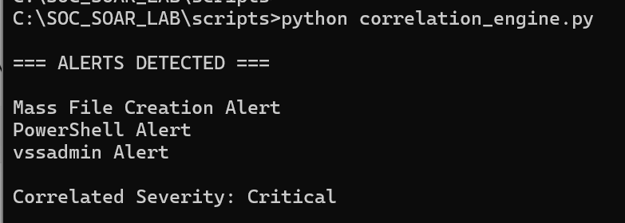
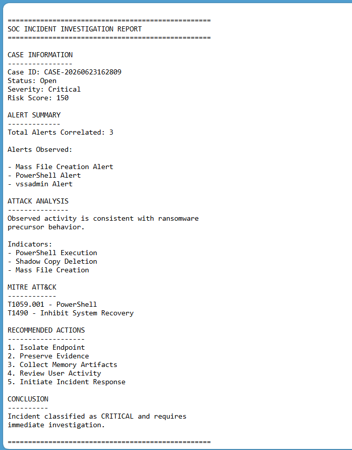
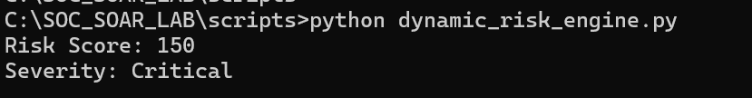
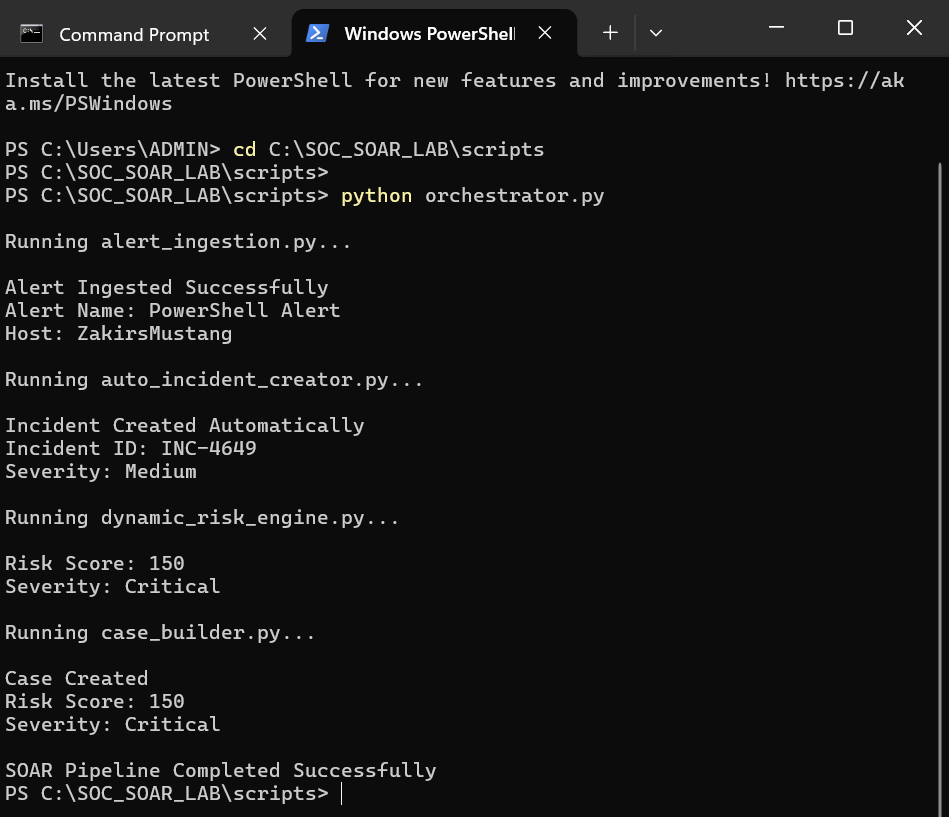
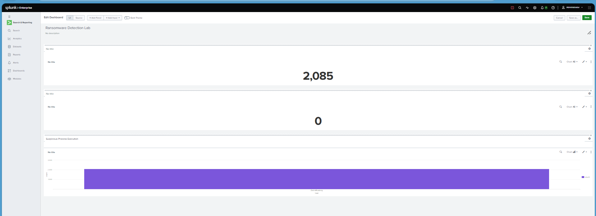

# Mini-SIEM-SOAR-Lab

A SOC automation lab using Sysmon, Splunk, Python, MITRE ATT&CK, alert correlation, risk scoring, incident response and case management.

---

## 📸 Screenshots











## 🛠 Tech Stack

- Python

## 📁 Project Structure

```
README.md
mass_file_alert.json
powershell_alert.json
vssadmin_alert.json
case.json
case_report.txt
incident_report.txt
investigation_report.txt
response_action.txt
correlation_engine.png
investigation_report.png
risk_scoring.png
soar_orchestrator.png
splunk_dashboard.png
alert_ingestion.py
auto_incident_creator.py
case_builder.py
case_manager.py
correlation_engine.py
dashboard_summary.py
dynamic_risk_engine.py
incident_generator.py
incident_processor.py
investigation_report.py
logger.py
orchestrator.py
report_generator.py
response_engine.py
risk_scoring.py
test_logger.py
timeline_engine.py
exported_alert.json
mitre_mapping.json
```

## 🚀 Getting Started

```bash
git clone https://github.com/YOUR_USERNAME/Mini-SIEM-SOAR-Lab.git
cd Mini-SIEM-SOAR-Lab
```

## 📄 License

MIT License

---

> Forged with ⚡ by **FORGE**
